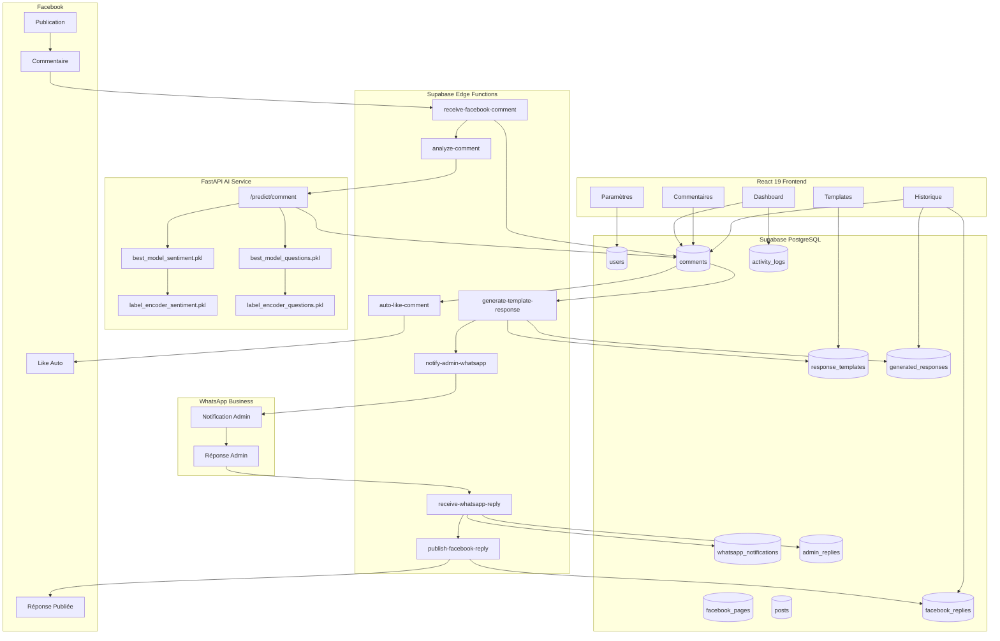

# Diagramme d'Architecture - Facebook Comment AI SaaS

## Flux de Données

1. **Webhook Facebook** reçoit le commentaire
2. **Edge Function** l'enregistre et déclenche l'analyse
3. **FastAPI** charge les modèles .pkl et prédit sentiment + question
4. **Résultats** sauvegardés dans PostgreSQL
5. **Auto-like** si sentiment positif (seuil configurable)
6. **Moteur de templates** si question détectée
7. **WhatsApp** notifie l'admin avec la réponse proposée
8. **Admin** valide/modifie via réponse WhatsApp
9. **Publication** automatique sur Facebook
10. **Dashboard** temps réel via Supabase Realtime
